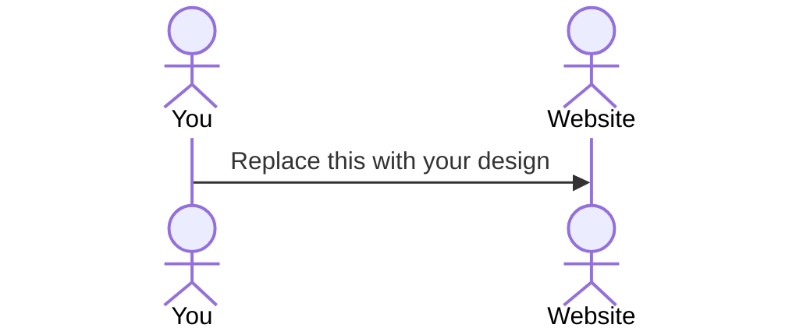

# Personal portfolio

[My Notes](notes.md)

I am planning to create a personal portoflio website for displaying User Experience projects with a built in chat window that allows employers and other people to reach out to me over the website. Portfolio will also include support for locked projectes with log in requirements in order to view said locked projects, and persistent messaging between viewers and myself that will email both parties additionally.

## 🚀 Specification Deliverable

- [x] Proper use of Markdown
- [x] A concise and compelling elevator pitch
- [x] Description of key features
- [x] Description of how you will use each technology
- [x] One or more rough sketches of your application. Images must be embedded in this file using Markdown image references.

### Elevator pitch

Imagine a designer who is proficent with design systems and has technical coding experience to compliment the skill, who can also design with development limitations in mind. This is a personal portfolio that an such an individual is creating in order to showcase their expertise in the field. It is a full stack design portfolio creates from scratch, that implements browser to browser communication and persistent user information. (I promise I'm not trying to sound high and mighty, but it says elevator pitch so I have to pitch it)

### Design

The first fold of landing page will display my name, and a short ad lib about me, messages, and navigation. It will also contain my top 3 interests in the field of both UX Design & Computer Science. When one of these interests is hovered a visual design corresponding to the item will appear to the right of the item.

The project view will display the visual of the project with a short description, then jump into scope, role, and timeline.
Afterwards the content for the case study will follow and have a persistent UI showcasing where in the process the user currently is.

### Key features

- Introductory landing page about owner.
- 1 design portfolio piece.
- Live chat feature with owner.
- Log in feature for accessing locked portfolio pieces.
- Light / dark mode toggle w/ cookie.
- Owner portfolio piece analytics with viewcount & duration.

### Technologies

I am going to use the required technologies in the following ways.

- **HTML** - Uses correct HTML structure for application. Three HTML pages for log in, landing page and 1 portfolio piece.
- **CSS** - Visual effects, hover animations & dark mode variations.
- **React** - Provides login, messaging board, and interactive navigational buttons for portfolio piece and landing page.
- **Service** - Backend service with endpoints for:
  - login
  - retrieving preferences
  - sending & retrieving messages
  - retrieve & store page analytic for owners view
- **DB/Login** - Store users, messages, preferences in database. Register and login users. Cant view project unless logged in to whitelisted account.
- **WebSocket** - When users send messages they update live to their pages.

## 🚀 AWS deliverable

For this deliverable I did the following. I checked the box `[x]` and added a description for things I completed.

- [x] **Server deployed and accessible with custom domain name** - [My server link](https://yourdomainnamehere.click).

## 🚀 HTML deliverable

For this deliverable I did the following. I checked the box `[x]` and added a description for things I completed.

- [x] **HTML pages** - I created four html pages. A log in page, a projects page, an about me page, and a resume page.
- [x] **Proper HTML element usage** - I attempted to use the best HTML elements for each item, using images, forms, divs, sections, radio buttons, etc. to properly structure HTML content.
- [x] **Links** - I added links to each of the html pages and my github repository.
- [x] **Text** - I added meaningful and accurate text to each page and as placeholders for my other deliverables.
- [x] **3rd party API placeholder** - Added a placeholder in about.html for my GitHub commits that will be grabbed from 3rd party api
- [x] **Images** - I added an image for my Github commits and my Outbound Project.
- [x] **Login placeholder** - Created the log in page. Similar to Simon.
- [x] **DB data placeholder** - Created the preferences button in header of Resume.thml (to not clutter each page) and placeholder for preferences to be logged in database.
- [x] **WebSocket placeholder** - Added a placeholder button for messages and what the aside / div will look like on Resume.html (to not clutter each page).

## 🚀 CSS deliverable

For this deliverable I did the following. I checked the box `[x]` and added a description for things I completed.

- [x] **Visually appealing colors and layout. No overflowing elements.** - Colors and layouts are done in a designed fashion.
- [ ] **Use of a CSS framework** - I do not think that I understood this deliverable fully, apologies.
- [x] **All visual elements styled using CSS** - All visual elemnts except the message board and dark/light mode have been styled. I am somewhat waiting for Javascript for these since they only appear on button click / hover.
- [x] **Responsive to window resizing using flexbox and/or grid display** - Many elements are responsive to page resizing using flexboxs. Login page is probably most complete in this regard.
- [x] **Use of a imported font** - Proxima Nova is used from Adobe Fonts.
- [x] **Use of different types of selectors including element, class, ID, and pseudo selectors** - I use element, class, ID, and one Pseduo selector in css.

## 🚀 React part 1: Routing deliverable

For this deliverable I did the following. I checked the box `[x]` and added a description for things I completed.

- [x] **Bundled using Vite** - The project is bundled using vite.
- [x] **Components** - I turned each pages unique content into a component, along with any item that is used more 2+ times.
- [x] **Router** - Routes have been set up to work, changing the main body content of the page.

## 🚀 React part 2: Reactivity deliverable

For this deliverable I did the following. I checked the box `[x]` and added a description for things I completed.

- [x] **All functionality implemented or mocked out** - I have added most functionality, there is a login and logout feature, that chat window opens when pressed, users can navigate the pages using the keyboard, and there is limited functionality of hovering or selecting something in the hero sections "obsessions" categories.
- [x] **Hooks** - I used useEffect and useState hooks to create the message window, and display a chat after time passes, allow users to navigate using keyboard keys to pages, type in a username and sign in (password not used currently), and implment a "view" count for project pieces that currentl increments upward each second or so.

## 🚀 Service deliverable

For this deliverable I did the following. I checked the box `[x]` and added a description for things I completed.

- [x] **Node.js/Express HTTP service** - The backend runs with node and express http service on port 4000
- [x] **Static middleware for frontend** - Backend has middleware that controls frontend calls to the backend.
- [x] **Calls to third party endpoints** - The About page calls a Github API Endpoint to get the languages and bytes of each language from my startup repo.
- [x] **Backend service endpoints** - Backend has endpoints for Auth allows users to be read / remembered & stored, and uses BCrypto hash passwords
- [x] **Frontend calls service endpoints** - In About page frontend calls Github API, in App.jsx frontend calls all server API's related to Auth and logout, and passes functions to other pages to allow them to interact with server API's.
- [x] **Supports registration, login, logout, and restricted endpoint** - Website supports registration, login, logout and restricted endpoints.

## 🚀 DB deliverable

For this deliverable I did the following. I checked the box `[x]` and added a description for things I completed.

- [ ] **Stores data in MongoDB** - I did not complete this part of the deliverable.
      <<<<<<< HEAD
- [x] **Stores credentials in MongoDB** - Users tokens emails and hashed password exist within a Mongo Database that is automatically updated with the user of endpoints and functions when the user logs in, logs out, creates an account.

## 🚀 WebSocket deliverable

For this deliverable I did the following. I checked the box `[x]` and added a description for things I completed.

- [x] **Backend listens for WebSocket connection** - Backend listens for websocket upgrade request and handles it, and also takes care of messaging, and user roles and other items needed.
- [x] **Frontend makes WebSocket connection** - The front end requests a websocket upgrade and also handles messages being shown in UI. Currently if a user logs in with "ethawkes2@gmail.com" they get the "owner" designation and their messages pop up on the left. Other messages go to the right, as this is meant to message me.
- [x] **Data sent over WebSocket connection** - Data successfully is transmitted between the multiple websocket connecitons like a chatroom.
- [x] **WebSocket data displayed** - The front end successfully displays data from other socket connections as well as their own.
- [x] **Application is fully functional** - Partially. Application still has many areas that are not finished, but items such as loging in and out, switching web pages, backend API calls, and chat room are operational / functional.
